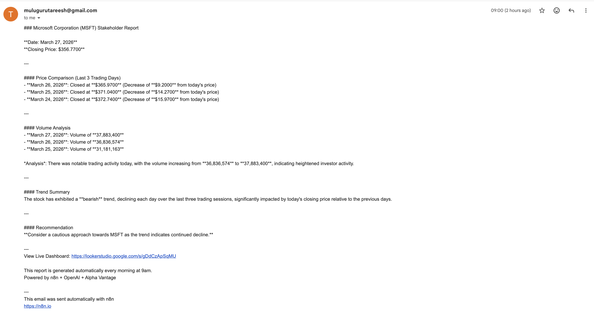

# AI-Powered MSFT Daily Stock Report Automation

An n8n workflow that automatically fetches real-time Microsoft (MSFT) 
stock data, generates a professional analyst report using OpenAI, and 
delivers it to stakeholders via Gmail every morning at 9am — including 
a link to a live Looker Studio dashboard.

## Live Dashboard
📊 [View Live MSFT Dashboard](https://lookerstudio.google.com/s/uPER3TC40cs)

## Business Problem
Financial and operations teams spend significant time manually pulling 
stock data, interpreting trends, and writing stakeholder updates. This 
workflow eliminates that manual effort entirely — saving an estimated 
30-45 minutes of analyst time per day.

## Workflow Architecture

Schedule Trigger (9am daily)
→ HTTP Request (Alpha Vantage API — live MSFT stock data)
→ IF node (validates API response is not empty)
→ OpenAI GPT-4o-mini (generates professional analyst narrative)
→ IF node (validates OpenAI response before sending)
→ Gmail (delivers report + dashboard link to stakeholders)
→ Google Sheets (appends fresh data for dashboard)

## Error Handling
- Dedicated Error Workflow catches any node failure automatically
- IF node validates Alpha Vantage data before calling OpenAI
- IF node validates OpenAI response before sending email
- Alert email sent to admin with failure details and troubleshooting steps

## Sample Email Report

## Live Dashboard

## Data Source

## Tools & Technologies
- n8n (workflow automation)
- Alpha Vantage API (real-time financial data)
- OpenAI GPT-4o-mini (AI narrative generation)
- Google Sheets (automated data storage)
- Google Looker Studio (live visual dashboard)
- Gmail API (automated email delivery)

## BA Deliverables
This project includes standard Business Analyst documentation:
- Workflow process flow (as-is to to-be)
- Business requirements: automate daily financial reporting
- Stakeholder: Finance and Investment teams
- ROI: 30 min/day analyst time saved = 130+ hours/year
- Error handling: automated failure detection and admin alerts

## How to Run
1. Import workflow.json into your n8n instance
2. Add credentials: Alpha Vantage API key, OpenAI API key, 
   Gmail OAuth, Google Sheets OAuth
3. Create a Google Sheet with columns: Date, Open, High, 
   Low, Close, Volume
4. Connect your Looker Studio to that Google Sheet
5. Set up the Error Handler workflow and link it in settings
6. Update the recipient email in the Gmail node
7. Activate the workflow

## Author
Tareesh Muluguru — Business Analyst
[LinkedIn](https://linkedin.com/in/tareesh-m) | 
[Email](mailto:tmuluguru@gmail.com)
