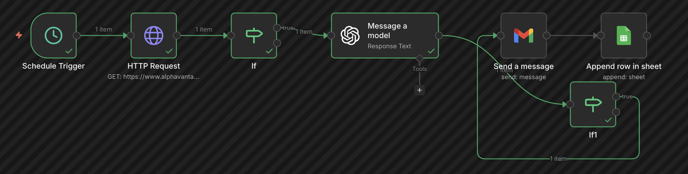
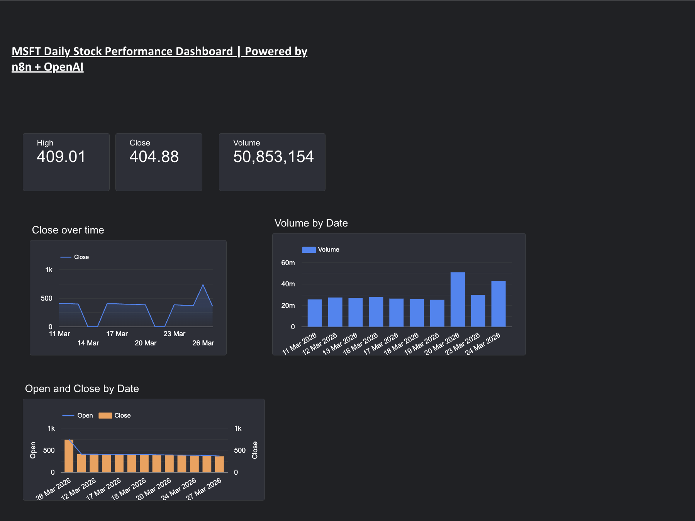
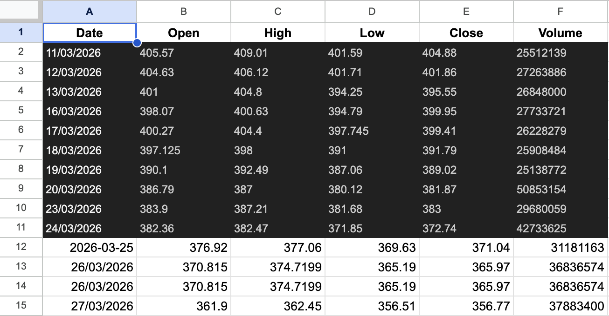

# AI-Powered MSFT Daily Stock Report Automation

An n8n workflow that automatically fetches real-time Microsoft (MSFT) 
stock data, generates a professional analyst report using OpenAI, and 
delivers it to stakeholders via Gmail every morning at 9am — including 
a link to a live Looker Studio dashboard.

## Live Dashboard
📊 [View Live MSFT Dashboard](https://lookerstudio.google.com/s/gDdCzApSqMU)

## Business Problem
Financial and operations teams spend significant time manually pulling 
stock data, interpreting trends, and writing stakeholder updates. This 
workflow eliminates that manual effort entirely — saving an estimated 
30-45 minutes of analyst time per day.

## Workflow Architecture

Schedule Trigger (9am daily)
→ HTTP Request (Alpha Vantage API — live MSFT stock data)
→ OpenAI GPT-4o-mini (generates professional analyst narrative)
→ Google Sheets (appends fresh data for dashboard)
→ Gmail (delivers report + dashboard link to stakeholders)

## Sample Email Report

## Live Dashboard

## Data Source

## Tools & Technologies
- n8n (workflow automation)
- Alpha Vantage API (real-time financial data)
- OpenAI GPT-4o-mini (AI narrative generation)
- Google Sheets (automated data storage)
- Google Looker Studio (live visual dashboard)
- Gmail API (automated email delivery)

## BA Deliverables
This project includes standard Business Analyst documentation:
- Workflow process flow (as-is to to-be)
- Business requirements: automate daily financial reporting
- Stakeholder: Finance/Investment teams
- ROI: ~30 min/day analyst time saved = 130+ hours/year

## How to Run
1. Import workflow.json into your n8n instance
2. Add credentials: Alpha Vantage API key, OpenAI API key, Gmail OAuth, Google Sheets OAuth
3. Create a Google Sheet with columns: Date, Open, High, Low, Close, Volume
4. Connect your Looker Studio to that Google Sheet
5. Update the recipient email in the Gmail node
6. Activate the workflow

## Author
Tareesh Muluguru — Business Analyst
[LinkedIn](https://linkedin.com/in/tareesh-m) | 
[Email](mailto:tmuluguru@gmail.com)
